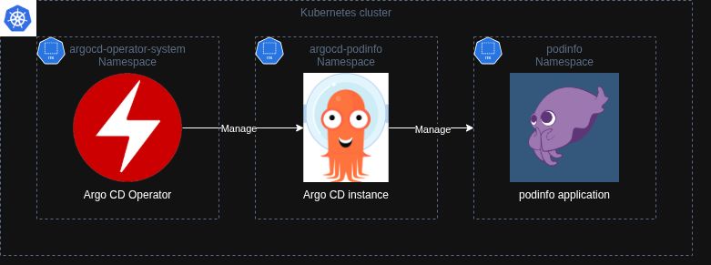
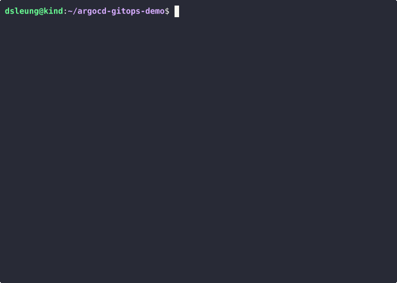

# argocd-gitops-demo

Implementing GitOps practices with Argo CD

## Architecture

## Dependencies

The reference environment is described below.

| OS | vCPU | Memory \(GiB\) | OS disk \(GiB\) |
| --- | --- | --- | --- |
| Ubuntu 24.04 LTS | `4` | `8` | `64` |

Install the following tools:

- [Docker](https://www.docker.com/) / [Podman](https://podman.io/)
- `jq`
- [mikefarah/yq](https://github.com/mikefarah/yq)
- `kubectl` 1.35
- [Helm](https://helm.sh/)
- [KinD](https://kind.sigs.k8s.io/)
- `make`
- [Go](https://go.dev/) 1.25

## Walkthrough

The Asciicast recording is available on [Asciinema](https://asciinema.org/a/768924).

## Credits

The Kustomize base manifests under `podinfo/base/` are shamelessly taken from [stefanprodan/podinfo](https://github.com/stefanprodan/podinfo).

## License

[Apache 2.0](./LICENSE)
